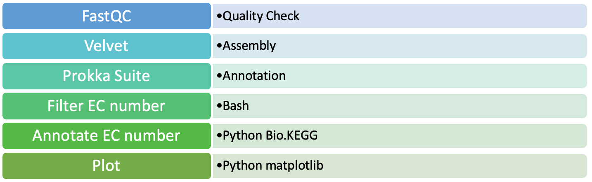

# About the Project

(Please refer python notebook for the detailled code and output)
Functional Annotation of Vaginal Metagenomic reads

-	Bacterial vaginosis is caused by predominantly anaerobic microorganisms such as Gardnerella vaginalis and Prevotella, Peptostreptococcus and Bacteroides spp affecting arounds 21.2 million women in United States alone
-	It is characterized by change in the pH and lactic acid production in vagina, decrease in Lactobacillus species in vaginal microbiome
-	Annotation of enzymes in metagenomic samples collected from Vaginal Introitus, Mid-Vagina from Human Microbiome Project and vaginal fluid infected with Bacterial Vaginosis
-	Created a pipeline using publicly available tools, databases, Bash and Python script to find and annotate enzymes 

---

### Samples: 
1. Samples of the metagenomic data were collected from the Human Microbiome Project from vaginal introitus and mid-vagina sites. Human Microbiome Project is a consortium of whole metagenomic shotgun sequences of 15-18 body-sites from 300 healthy individuals. 
2. Metatranscriptomics data from vaginal fluid form women infected with Bacterial Vaginosis (BV) (European Nucleotide Archive accession number: PRJEB21446)
3. Reference genome of Lactobacillus Crispatus (NCBI)
4. Reference genome of Gardnerella Vaginolis

---
### Methods:

Quality Check: Reads from vaginal introitus and mid-vagina were subjected to quality check using FastQC. FastQC is a quality control tool used on data coming from high-throughput sequencing pipelines to trim adaptors and low-quality reads from the samples. 
Assembly: Reads were assembled using Velvet which is a de novo assembler for shortreads into scaffolding by building a de Bruijn graph. To begin with velvet, khmer was used to interleave the paired-end reads into a single file as accepted by velvet. In this process, the first step is providing a hashtable created by velveth. The length of k-mer in the hashtable is user specified and we are using hash length of 21 which is generally considered to be a good hash length. Hashtable is essential for building de Bruijn graph by velvetg. The second step is to read align-ments, remove errors and build de Brujin graph. 
Functional Annotation: To annotate the gene found in the assembly Prokka suite was used which annotates features of the genome sequences from de novo assembly using feature prediction tools in a hierarchical manner. Feature prediction tools used by Prokka are Prodigal, RNAmmer, Aragorn, SignalP, Infernal which predict coding sequences, ribosomal RNA genes, Transfer RNA, Signal leader peptides, Non-coding RNA respectively. 
Extracting EC numbers: EC numbers from the GFF3 file produced by Prokka was extracted using the following bash script and regular expression:

`grep -oE "eC_number=[0-9].[0-9,-]*.[0-9,-]*.[0-9,-]*" PROKKA_filenample.gff > output_EC_numbers.csv`

Annotating EC numbers: Each CSV file was converted to DataFrame in Python and linked to KEGG Database to annotated each found enzyme. Library requirements are listed in the Jupyter notebook attached in Supplementary Material. KEGG Database is consortium of eighteen databases containing systems information, genomic information, chemical information and health information. We are using KEGG ENZYME database to annotate enzymes.

Pipeline: 

